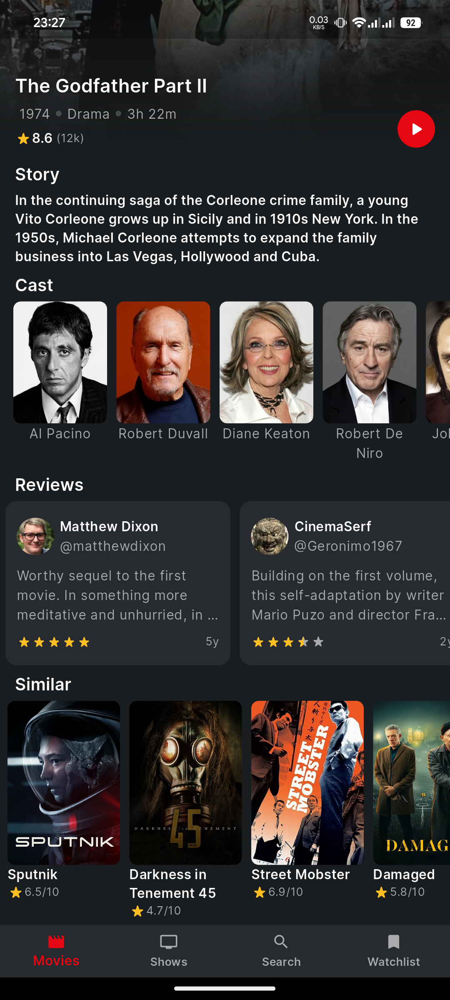

# FilmFlix

Yet Another Movies App built with Flutter using the TMDB API, following the Clean Architecture pattern.
This app allows users to explore movies and TV shows, search for content, view details, and add items to their watchlist.

## Features

- **Browse popular and top-rated movies/shows.**

- **Search for movies & series.**

- **View movie/serie details, including cast and crew.**

- **Watch trailers and reviews.**

- **Add movies/shows to your watchlist.**

- **View your watchlist.**

- **Infinite Scrolling**

- **Responsive Design**


## Screenshots

| **Movies Page** | **Series Page** | **Search Page** | **Watchlist Page** |
| --- | --- | --- | --- |
|  |  |  |  |

| **Movie Details** | **Show Details** | **Top Movies** | **Popular Series** |
| --- | --- | --- | --- |
|  |  |  |  |

## Getting Started

### Prerequisites

- Flutter SDK [official Flutter website](https://flutter.dev/docs/get-started/install).

### Installation

1. Clone the repository:

   ```bash
   git clone https://github.com/MrMDrX/FilmFlix-App.git FilmFlix
   ```

2. Navigate into the project directory:

   ```bash
   cd FilmFlix
   ```

3. Install the dependencies:

   ```bash
   flutter pub get
   ```

4. Run the application:

   ```bash
   flutter run
   ```

## Key Dependencies
<details>

<summary>Click to expand the main dependencies</summary>

- **flutter**: The core framework for building cross-platform mobile apps.
- **flutter_bloc**: BLoC (Business Logic Component) for state management, promoting separation of concerns.
- **get_it**: A service locator for dependency injection, allowing easy management of app services.
- **dio**: Powerful HTTP client for making network requests and handling API calls.
- **dartz**: A functional programming library for Dart, useful for handling Option and Either types.
- **go_router**: Simplifies navigation and routing across app screens.
- **hive_flutter**: Provides local storage capabilities for Flutter apps using Hive.
- **equatable**: Helps in value comparison for immutable objects, widely used in BLoC state management.
- **url_launcher**: Allows launching URLs in a browser, email, or other apps.
- **stream_transform**: Extends streams with additional transformation operators.
- **google_fonts**: Easily use Google Fonts in the app.
- **cupertino_icons**: Provides iOS-style icons for the app.
- **carousel_slider**: Provides a carousel widget to display a horizontal scrolling list of items.
- **cached_network_image**: Efficiently loads and caches images from the network to improve performance.
- **flutter_rating_bar**: Customizable rating bar widget for displaying ratings.
- **shimmer**: UI library to implement shimmer loading effects for better user experience.
- **readmore**: A widget for displaying truncated text with a "read more" option.

</details>

## Contributing

We welcome contributions! If you have suggestions or improvements, please open an issue or submit a pull request.

## License

This project is licensed under the MIT License - see the [LICENSE](LICENSE.md) file for details.